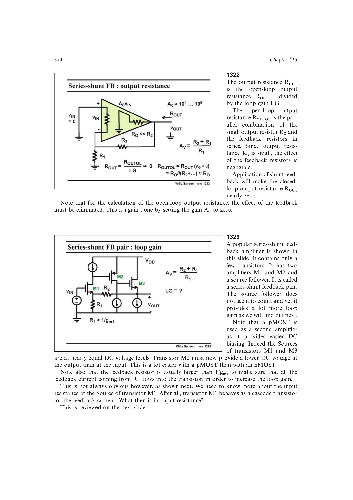

# 串并联反馈三管组

MOS 串并联反馈组由输入增益管、反相第二级和源跟随输出级构成。源跟随器的电压增益虽接近一，却以约 `1/gm` 的低输出阻抗隔离反馈电阻，使反馈电流进入输入级并保留较大的环路增益。

有源负载使级增益接近 `gm*ro`；改用电阻负载会引入分压并降低环路增益。pMOS 第二级还可提供所需的向下直流电平移动。

来源：第 13 章 pp. 374-379，1323-1331。

## 原书图示

