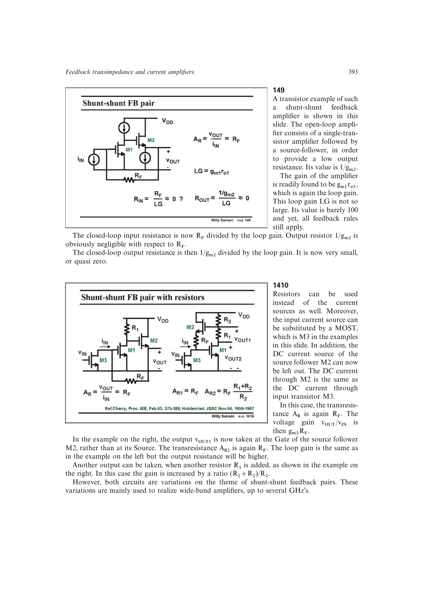

# 并并联反馈晶体管组

单管电压增益级后接源极或射极跟随器，可构成宽带并并联反馈组。前级提供 `T~=gm1*ro1`，跟随器把开环输出阻抗降到约 `1/gm2`，于是 `Rin~=RF/(1+T)`，`Rout~=(1/gm2)/(1+T)`。

单个反相级可闭合负反馈；若要显著提高环路增益，可用三个反相增益级。差分结构则允许用两个级并维持负反馈。

来源：第 14 章 pp. 393-395、397-399，149-1421。

## 原书图示

