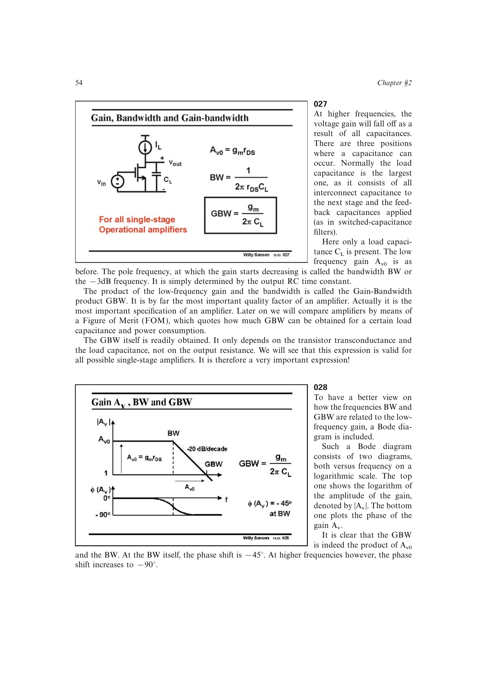

# 单级放大器增益带宽积

当输出负载电容 `CL` 形成唯一主极点时，`BW=1/(2*pi*Rout*CL)`，低频增益为 `gm*Rout`，所以

`GBW=Av0*BW=gm/(2*pi*CL)`。

输出电阻在乘积中抵消：提高 `Rout` 会等比例提高低频增益、降低带宽，却不改变 GBW。这个关系适用于以输出电容为主导的各种单级跨导放大器，并可定义功耗品质因数 `GBW*CL/ID`。

来源：第 2 章 pp. 54-55，027-029。

## 原书图示

