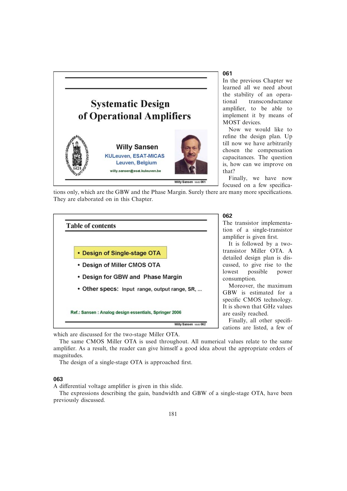

# 单级 OTA 尺寸流程

给定 `GBW` 与 `C_L` 后，先由 `g_m=2pi*GBW*C_L` 求跨导，再选过驱动得到电流和 `W/L`。沟道长度由增益要求决定，书中例题取约三倍最小长度，最后由工艺 `K'` 求宽度。

完成尺寸后必须回算电流镜节点的 `C_GS`、`f_T` 与极零双点；若其过低，可缩小器件并用级联管恢复增益。

来源：第 6 章 pp. 181-185，063-067。

## 原书图示

