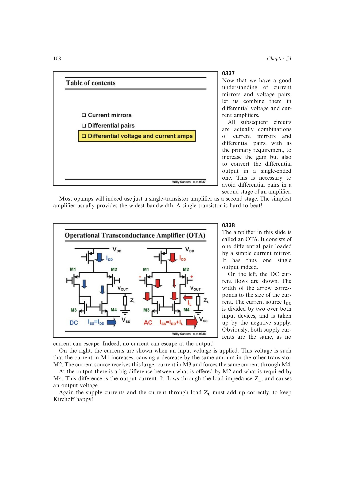

# 单级 OTA

单级运算跨导放大器把差分对的一侧增量电流经电流镜复制到单端输出，与另一侧电流相减。输出短路电流近似 `gm*vid`，有限负载时低频电压增益为 `gm*Rout`。

只有输出节点是高阻节点，因此它仍是单级放大器，`GBW=gm/(2*pi*CL)`。电流流向在四管中高度不对称，这是单端化的必然结果。

来源：第 3 章 pp. 108-110，0337-0340。

## 原书图示

