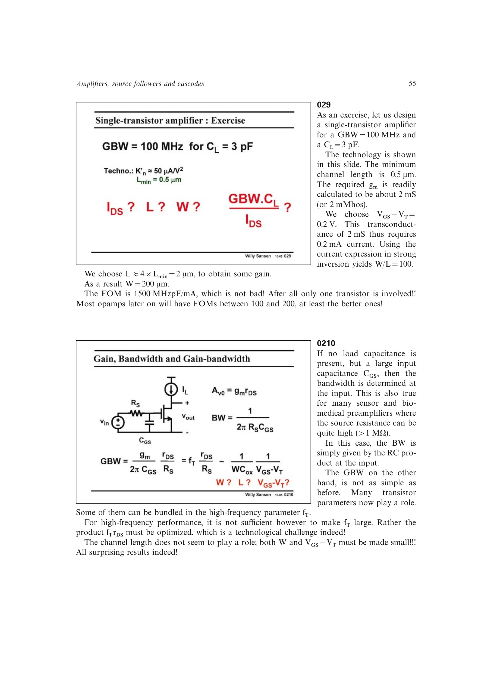

# 单级放大器寄生极点

除输出 `Rout*CL` 极点外，有限信号源电阻 `RS` 会与 `CGS` 形成输入极点；栅漏电容 `CGD` 还会同时改变输入和输出动态。若输入极点降到输出主极点附近，单极点 GBW 公式不再足够。

输入极点占主导时，提高晶体管 `fT`、减小 `L` 或调整 `W`/`VOV` 才能改善带宽；源书强调必须先判断固定了哪些设计参数，不能孤立断言带宽随某一参数单调变化。

来源：第 2 章 pp. 55-56、65-67，0210-0211、0231-0233。

## 原书图示

