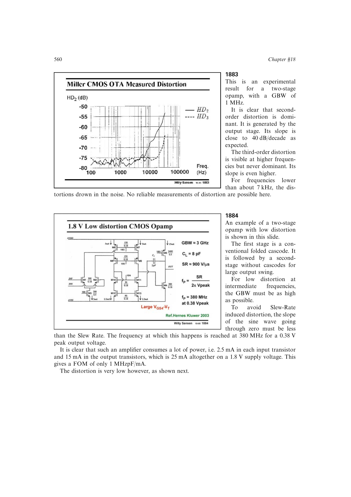

# 压摆率诱发失真

正弦输出 `vo=Vp*sin(2*pi*f*t)` 在过零点具有最大斜率 `2*pi*f*Vp`。若该斜率超过运放压摆率，补偿电容只能以有限电流充放电，波形逐渐三角化并产生很大的奇次谐波，尤其是 `HD3`。

避免条件是 `2*pi*f*Vp < SR`。一旦严重压摆，弱非线性幂级数不再适用，应按大信号电流和充放电路径分析。

来源：第 18 章 pp. 560、562，图 18.84、18.88。

## 原书图示

