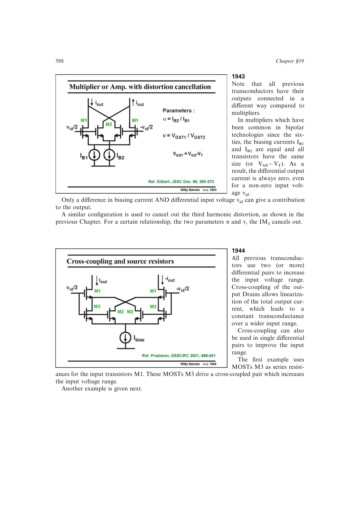

# 源跟随交叉耦合跨导器

输入源跟随器的低输出电阻约为 `1/gm1`；交叉耦合器件产生的负电阻 `-1/gm2` 与其部分抵消，在内部栅节点形成电压增益，再由输出器件 `gm3` 转换成差分电流。

两级 `VGS` 的串接扩大线性输入范围，电流增益由 `gm3/gm2` 与内部电压增益共同决定。结构只增加一个低阻内部节点，因此兼顾较高增益、线性度和高频性能。

来源：第 19 章 pp. 588-589，图 19.44-19.45。

## 原书图示

