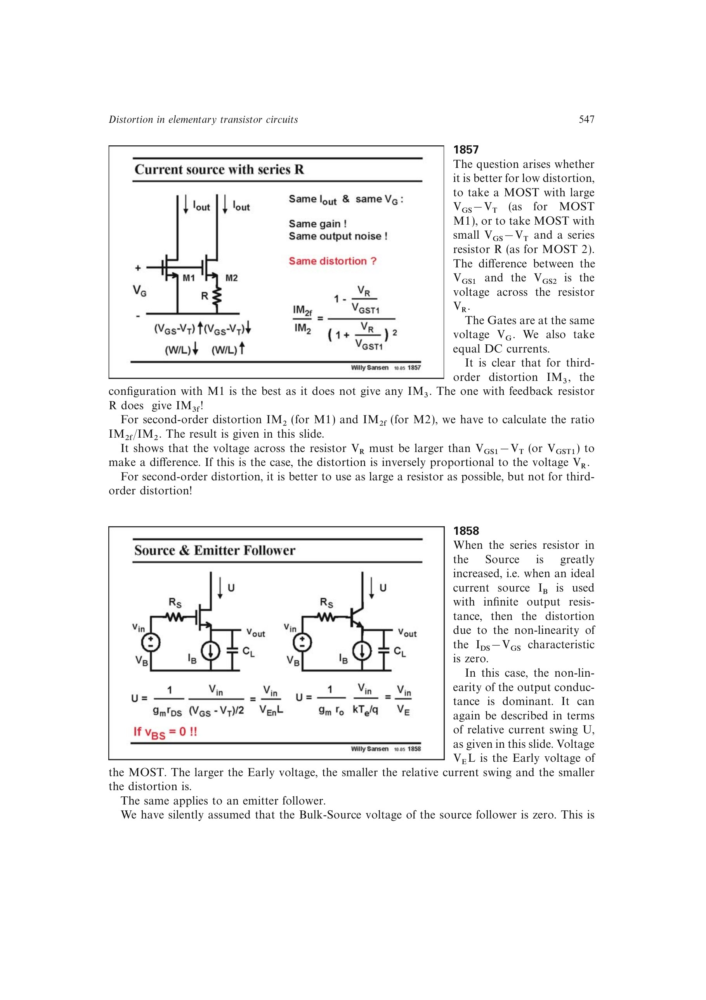

# 源跟随器输出电导失真

理想电流源负载的 MOST 源跟随器具有接近单位的电压反馈，跨导非线性受到抑制后，输出电导随 `VDS` 的变化可能成为主要失真源。若体端固定，信号相关的体效应还会改变阈值和增益，进一步增加失真。

提高沟道长度、保持输出器件的 `VDS` 较稳定，或采用级联与差分结构，可减小这些残余项，但会付出速度或摆幅代价。

来源：第 18 章 pp. 547-548，图 18.59-18.61。

## 原书图示

