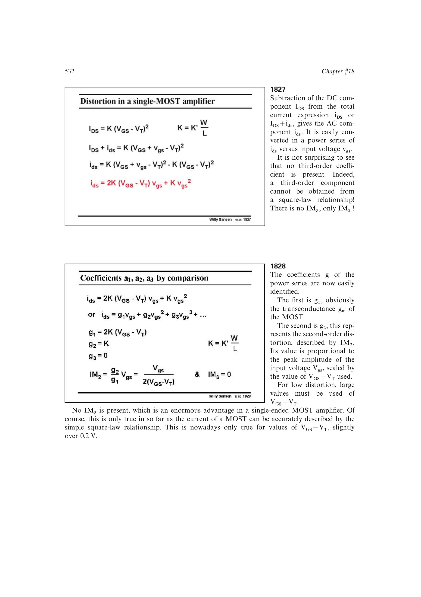

# 平方律 MOST 单管失真

强反型长沟道 MOST 的理想平方律在工作点附近归一化为

`y = u + (1/4)u^2`，其中电压尺度为 `(VGS-VT)/2`。

于是 `IM2=U/4`，理想模型的 `a3` 为零，不产生原生 `IM3`。真实器件仍有高阶跨导、输出电导、漏端和体效应非线性，所以“无三阶失真”只属于理想平方律模型。

来源：第 18 章 pp. 532-534，图 18.29-18.33。

## 原书图示

