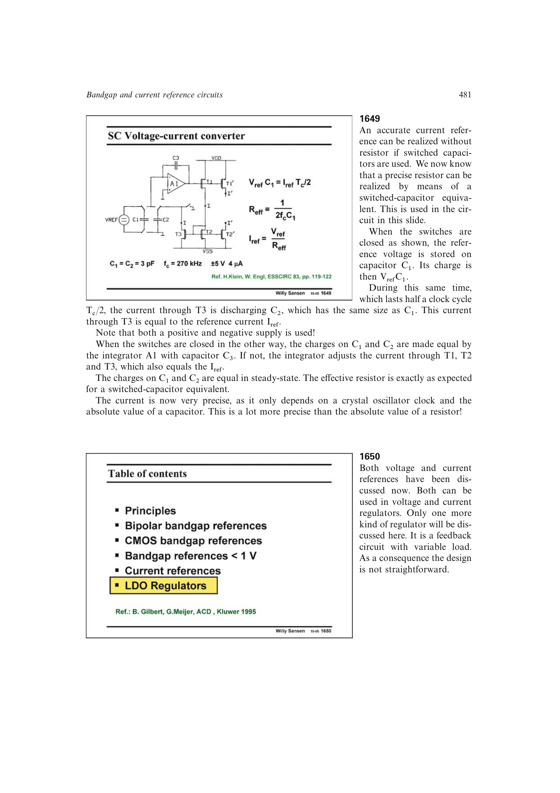

# 开关电容电流基准

开关电容转换器把参考电压存成电荷 `Vref*C`，再在半个时钟周期内由目标电流放电。稳态电荷平衡给出

`Reff=1/(2fcC)`，`Iref=Vref/Reff=2fcC*Vref`。

绝对电流由晶体时钟、绝对电容和参考电压决定，通常比集成电阻更准确。代价是时钟、开关、积分器、建立误差和源书实例所需的双极性供电。

来源：第 16 章 p. 481，1649。

## 原书图示

