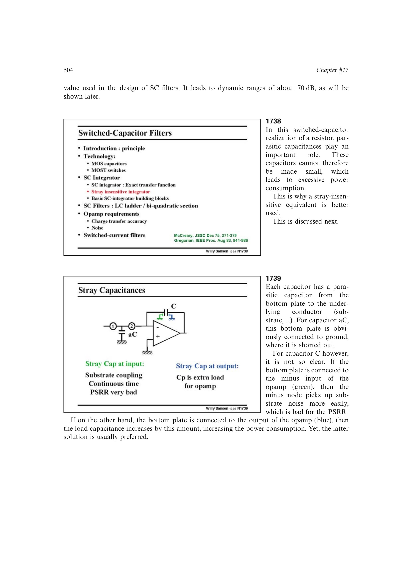

# 开关电容滤波器动态范围

开关电容滤波器的可用动态范围同时受电容失配、有限建立、时钟馈通、沟道电荷注入和折叠噪声限制。源书给出的常规量级约为 70 dB；继续提高精度会迫使电容、开关、运放增益和功耗同时增加。

因此最小单位电容不能只按面积选取，而要在匹配、`kT/C`、寄生与建立之间联合优化。

来源：第 17 章 pp. 504、515、517，图 17.37、17.60、17.65。

## 原书图示

