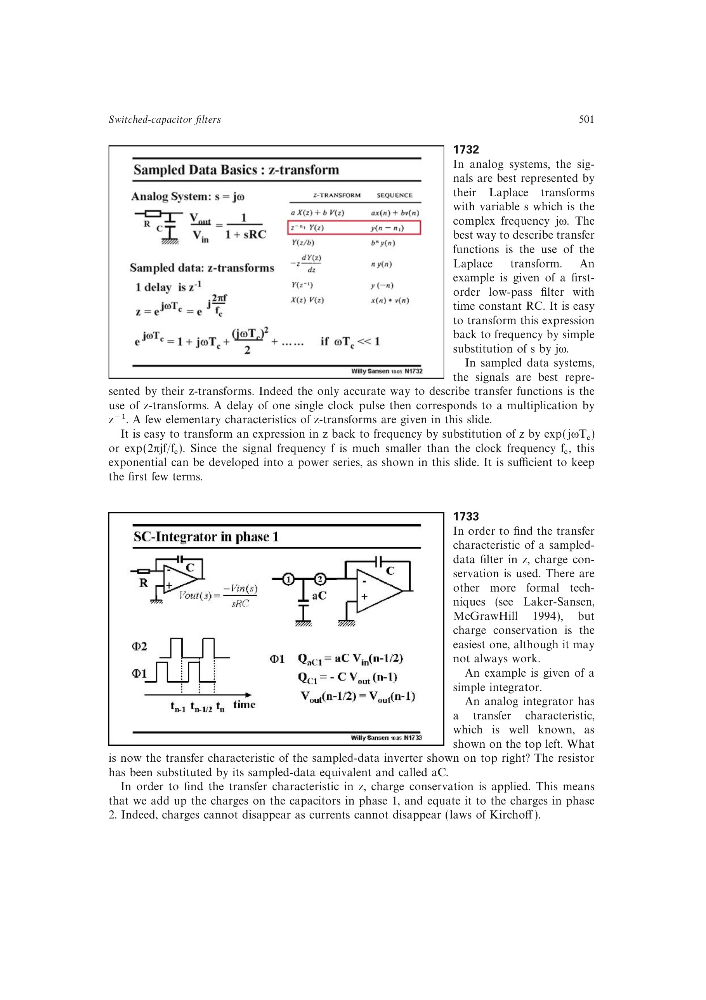

# 开关电容积分器

采样电容 `aC` 在相位 1 获取输入电荷，在相位 2 通过运放虚地把这份电荷全部转移到反馈电容 `C`。逐周期电荷守恒给出

`H(z)=Vout/Vin=-a*z^-1/2/(1-z^-1)`。

在 `omega*Tc<<1` 时，`H` 近似 `-a/(j*omega*Tc)`，等效连续时间积分器的时间常数为 `Tc/a`。精度依赖完整电荷转移、运放增益和电容比。

来源：第 17 章 pp. 501-503，图 17.33-17.36。

## 原书图示

