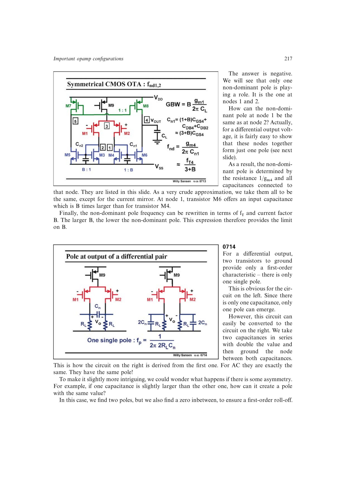

# 对称 OTA 的镜像增益上限

镜像增益 (B) 一方面按比例提高 (GBW)，另一方面通过 (f_{nd}simeq f_T/(3+B)) 压低非主极点。稳定设计必须同时满足目标 GBW 和非主极点间隔。

常用做法是令 (f_{nd}ge 3,GBW) 后求 (B) 的最大值；书中 200 MHz、2 pF 的例子得到 (Bapprox5)，并指出常用范围约为 3-5。

来源：第 7 章 pp. 217-218，0713-0716。

## 原书图示

