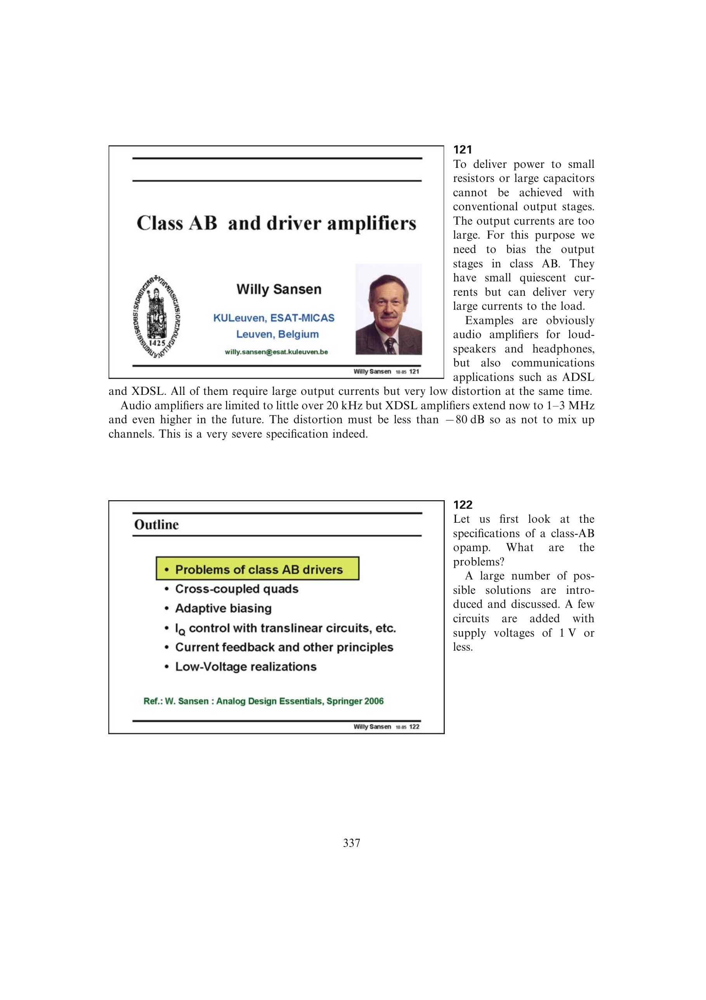

# 系统化 Class-AB 设计流程

Class-AB 设计应先由负载和摆幅选择推挽连接，再确定 `IQ` 与 `Imax/IQ`；随后选择扩张型电流机制和静态电流控制，检查交越区两管是否保持足够电流；最后核算所有交流路径的压摆率、非主极点、供电余量、失真和工艺角。

这个顺序把小信号稳定性、静态偏置和大信号驱动分开验证，再在最终拓扑中联合闭合，避免只看峰值电流或只看静态工作点。

来源：第 12 章 pp. 337-361，121-1248。

## 原书图示

