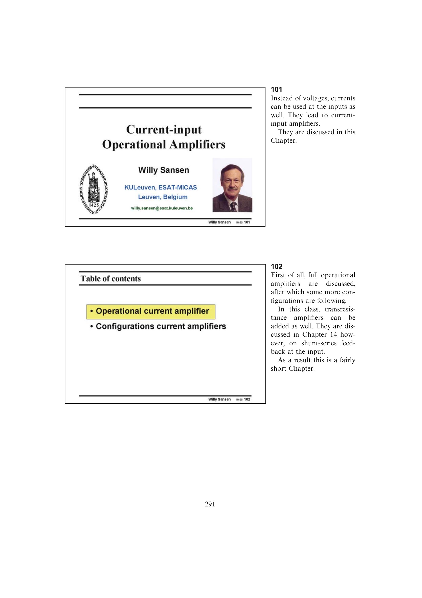

# 系统化电流运放设计顺序

先确认传感器确实提供电流并确定所需跨阻、负载电容和噪声带宽，再由 `A_R*BW` 选择镜像倍率与输出节点。随后按线性峰值电流确定偏置，检查允许 Class-AB 过驱还是必须避免失真。

闭环设计先决定固定 `R_S` 的 GBW 模式或固定 `R_F` 的恒带宽模式，再用输入电阻限制复核最高增益。需要更大摆幅或增益时才增加第二级，最后重新检查补偿稳定性、输入级噪声、SNR 和压摆率。

来源：第 10 章 pp. 291-300，101-1020。

## 原书图示

