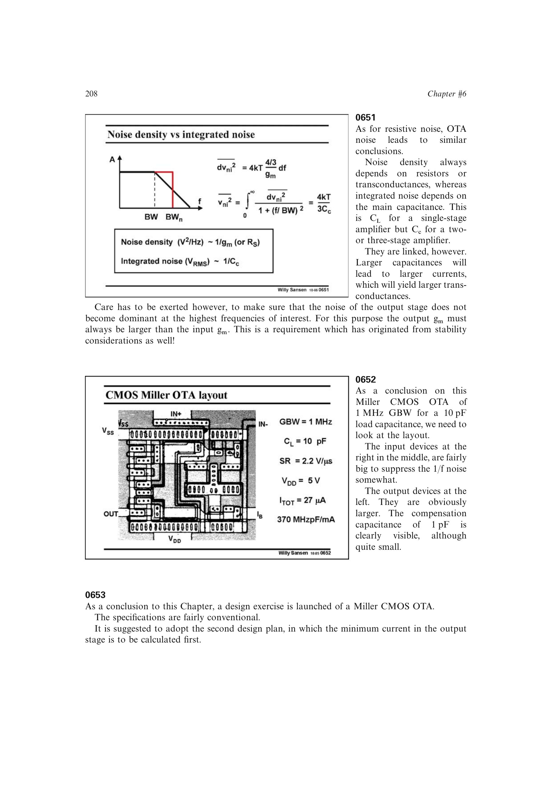

# 系统化 Miller OTA 设计顺序

推荐流程是：冻结关键规格和稳定性比例，先按输出级优先法求 `g_m6,I_D6,W6,C_n1`，再由非主极点关系求 `C_c`，最后由 GBW 求输入级 `g_m1`、电流和尺寸。

随后依次验证共模范围、输出摆幅、内部/外部 SR、建立时间、输出阻抗、噪声密度和积分噪声。规格多于自由度时必须回到关键规格集或提高拓扑复杂度，而非继续强行解同一组尺寸。

来源：第 6 章 pp. 208-209，0652-0654。

## 原书图示

