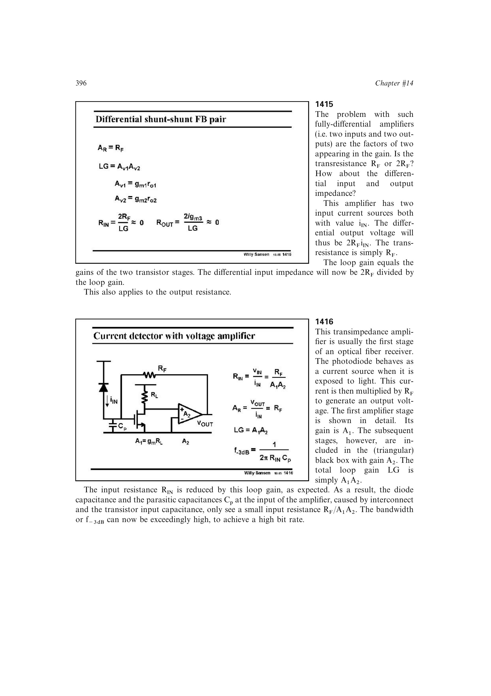

# 系统化光电接收前端设计

光电接收前端应先用 `CD`、输入电流范围和目标跨阻确定输入架构，再由 `AR*BW` 和二阶实极点条件分配各级增益；随后比较输入噪声密度与积分噪声，选择反馈电阻实现，并检查大光电流下的压缩、摆幅、供电和封装寄生。

这一顺序把传感器模型、带宽、稳定性、噪声、动态范围和物理电阻的高频非理想性闭合为可验证设计流程。

来源：第 14 章 pp. 396-420，1416-1464。

## 原书图示

