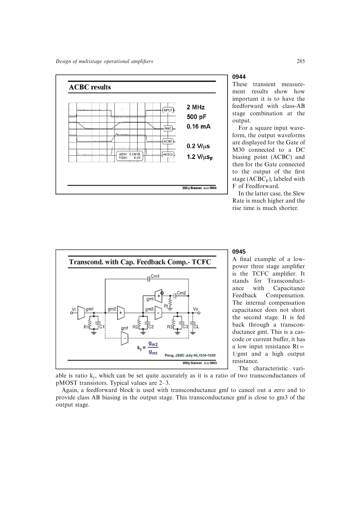

# TCFC 补偿

TCFC 通过低输入电阻、高输出电阻的跨导缓冲器 `g_mt` 回送第二补偿电容，使电容不再直接短路第二级或输出级。前馈跨导 `g_mf` 取消一个零点并提供 Class-AB 输出驱动。

其四极点三零点中，一组极零抵消，最高右半平面零点因 `k_t`、电容比和跨导比而远高于 GBW；剩余左半平面零点略高于主要非主极点，改善相位裕度。相同负载和功耗下，GBW 约为传统 NMC 的 41 倍。

来源：第 9 章 pp. 285-287，0945-0948。

## 原书图示

