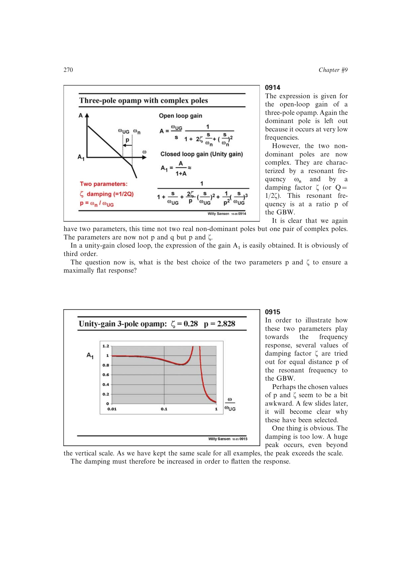

# 三阶 Butterworth 极点配置

三级单位增益闭环的最大平坦配置可由一只实极点和一对复共轭极点实现。书中以非主极点谐振频率相对 GBW 的比例 `p=2*sqrt(2)`、阻尼 `zeta=1/sqrt(2)` 得到三阶 Butterworth 响应。

该配置允许开环非主极点保持在较低频率，降低跨导和功耗；代价是闭环 `-3 dB` 带宽约降到开环 GBW 的 `0.3` 倍，且设计裕量较约 60 度相位裕度方案更紧。

来源：第 9 章 pp. 270-272，0914-0918。

## 原书图示

