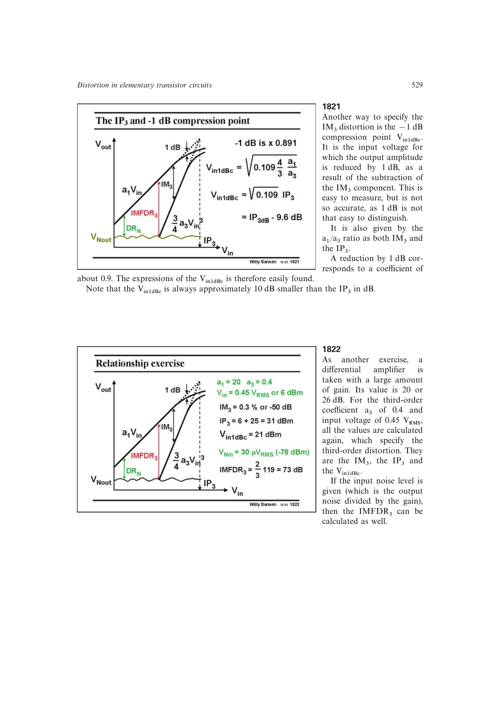

# 三阶互调无杂散动态范围

三阶互调无杂散动态范围 `IMFDR3` 是从输入噪声底到三阶互调外推线与噪声底相交处的可用输入范围。若噪声底为 `Vnin_dB`，则

`IMFDR3 = (2/3)*(IP3_dB - Vnin_dB)`。

它把线性度与噪声合并成通信前端可直接使用的动态范围指标；带宽改变噪声底时，数值也会随之改变。

来源：第 18 章 pp. 529-530，图 18.24。

## 原书图示

