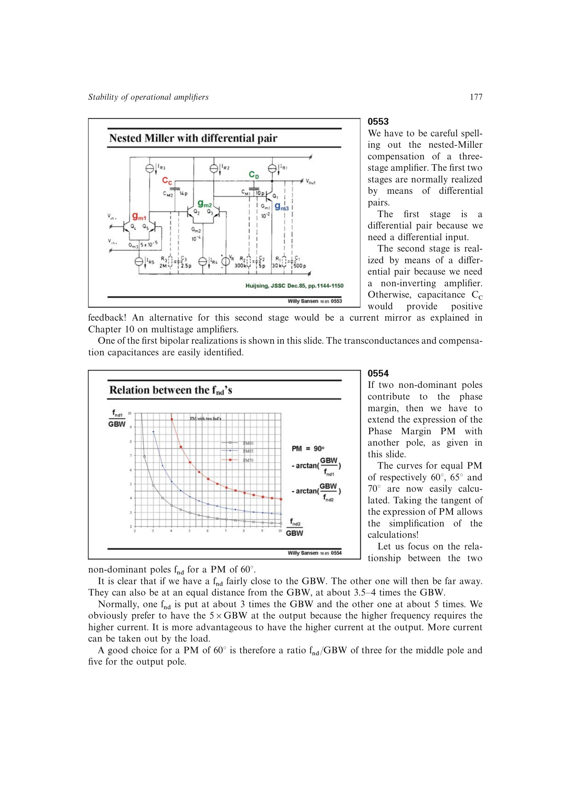

# 三级运放非主极点配置

两个非主极点共同消耗相位裕度。对约 `60 deg` 相位裕度，书中推荐把中间节点极点放在约 `3*GBW`，输出极点放在约 `5*GBW`；若两者相等，则约需 `3.5–4*GBW`。

更高频的极点需要更大跨导与电流，把它放在输出级更合理；推到超过 `6–7*GBW` 后总功耗会明显上升。

来源：第 5 章 pp. 177-178，0554-0555。

## 原书图示

