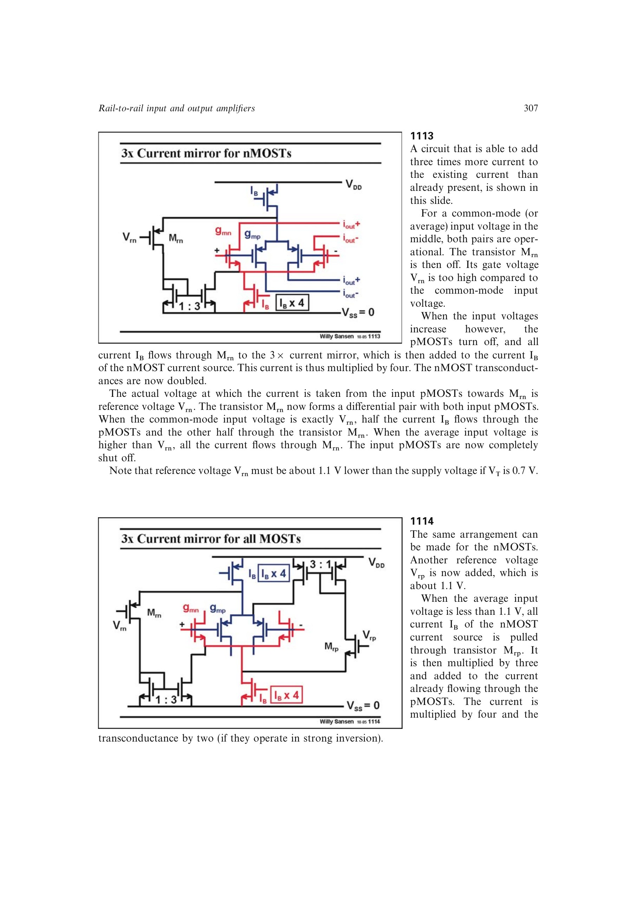

# 三倍电流镜均衡器

三倍电流镜均衡器用参考电压检测某一互补输入对即将关闭的共模位置。当该对关闭时，其尾电流经开关管送入 3× 电流镜，再与另一对原有电流相加，使导通对总电流达到四倍。

上下两侧各需一套参考和镜像网络。转换区因开关管与输入对共享电流，总 `g_m` 仍有约 15% 误差；参考电压还随 `VT` 和余量变化。

来源：第 11 章 pp. 307-309，1113-1116。

## 原书图示

