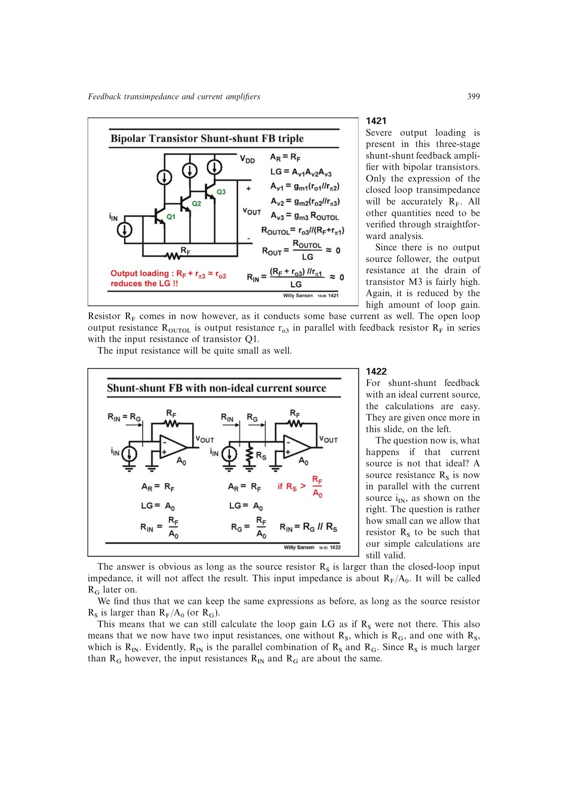

# 跨阻源阻抗阈值

非理想电流源可表示为理想 Norton 电流源并联源电阻 `RS`。只要 `RS >> RG`，其中反馈输入电阻 `RG~=RF/(1+T)~=RF/A0`，源电阻不会显著分走输入电流，跨阻和环路增益仍可按理想源计算。

实际输入阻抗为 `RS||RG`。这一区分避免把传感器源电阻误算进反馈网络自身的输入阻抗。

来源：第 14 章 pp. 399-400，1422-1423。

## 原书图示

