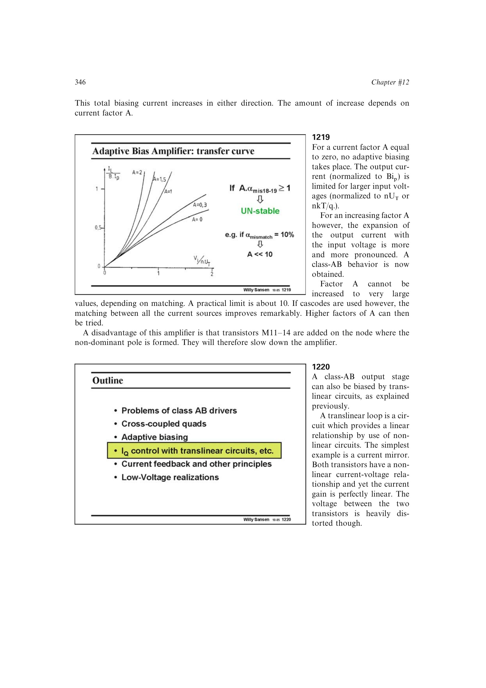

# 跨线性输出电流上限

普通跨线性 Class-AB 环能准确设定与电源近似无关的静态电流，但环中电流乘积或比例受固定参考支路约束。大信号时，只有一支趋近零，另一支才可能显著增加。

这使输出峰值电流受关断条件限制，并可能让另一只输出管完全截止。跨线性偏置适合精确 `IQ`，却不自动提供最大的 `Imax/IQ`。

来源：第 12 章 pp. 346-354，1220-1234。

## 原书图示

