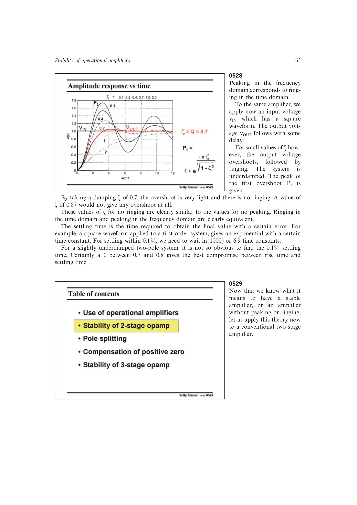

# 两级 Miller 运放

通用两级运放由输入跨导级 `g_m1` 和第二跨导级 `g_m2` 构成，两个高阻节点之间跨接补偿电容 `C_c`，输出驱动负载 `R_L,C_L`。`C_c` 利用 Miller 效应产生极点分裂。

这一抽象与具体 MOST 或 BJT 实现无关，是两级运放稳定性尺寸设计的核心模型。

来源：第 5 章 pp. 163-167，0529-0535。

## 原书图示

