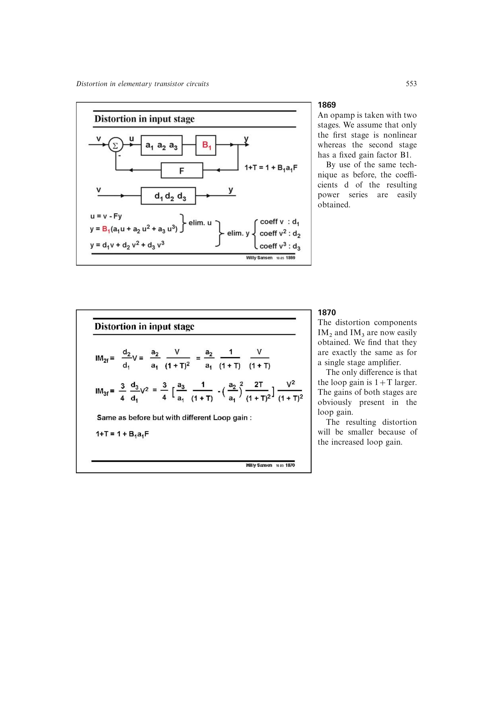

# 两级运放失真分配

两级 Miller 运放在低频时，第二级输入摆幅远大于差分输入级，因而输出级通常主导二阶和三阶失真。频率升高后，第一级所需输入迅速增大，输入差分对的三阶失真可接管 `IM3`；差分输入级不产生理想二阶项，所以 `IM2` 常继续由单端输出级或其输出电导主导。

两级贡献可能极性相反并出现局部抵消，但器件高阶项与失配会使实测零点不如低阶符号模型尖锐。

来源：第 18 章 pp. 553-561，图 18.72-18.86。

## 原书图示

