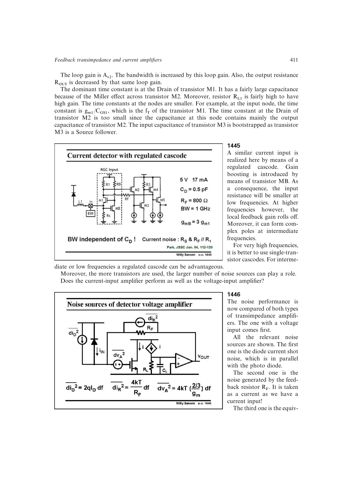

# 电压输入光接收器噪声

并并联光接收器折算到输入端的电流噪声密度近似为

`di_eq^2=di_D^2+4kT/RF+dv_amp^2/RF^2`。

输入管电压噪声被 `RF^2` 除小；`RF>2/(3gm)` 后它常可忽略，剩下光电二极管散粒噪声和反馈电阻热噪声。增大 `RF` 会降低电阻的等效电流噪声。

来源：第 14 章 pp. 411-412，1446-1447。

## 原书图示

