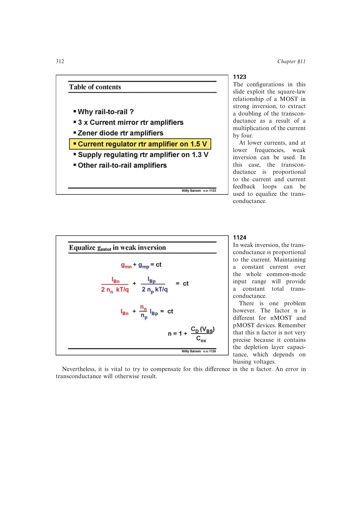

# 弱反型电流开关均衡

弱反型满足 `g_m proportional I_D`，关闭一套输入对时只需把导通对电流加倍。共模控制管可作为电流开关：中点时两套输入对分流，靠近电源轨时把固定总电流完全导向仍工作的输入对。

nMOST、pMOST 的亚阈值斜率因子 `n` 不同且随偏置变化，需要在电流镜比例中修正；参考电压选择不准会使转换区均衡误差增大。

来源：第 11 章 pp. 312-315，1123-1129。

## 原书图示

