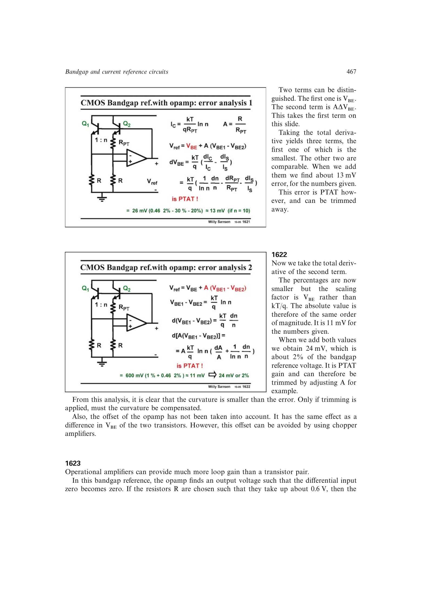

# 对运放式带隙基准做全微分误差预算

分别对 `VBE` 与 `A Delta VBE` 做全微分，器件参数、面积比和电阻比误差形成两个同数量级 PTAT 项；再加入运放输入失调等效的 `Delta VBE`。源书示例合计约 24 mV，即约 2%。

来源：第 16 章 p. 467，1621-1622。边权 3.5：联合闭环拓扑、MOST 失配、输入失调和电阻比误差完成一阶灵敏度分析。

## 原书图示

