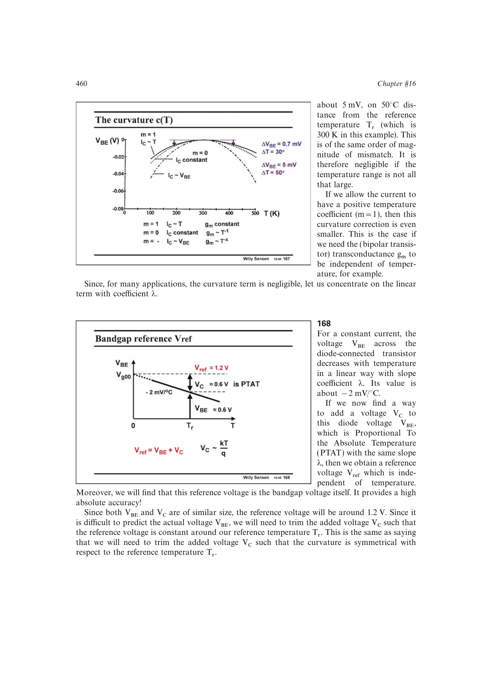

# 合成 CTAT VBE 与 PTAT 电压得到带隙基准

`VBE` 的一阶斜率约为 `-2 mV/degC`，PTAT 电流流过比例电阻后提供可调正斜率。选择 `nR1/R2` 使两斜率相消，输出 `VBE+n(R1/R2)UT ln(r)`，其截距落在约 1.2 V 的硅带隙尺度。

来源：第 16 章 pp. 460-462，168-1610。边权 4：这是本章关键桥梁，需要联合温度物理、PTAT 电流和可精确实现的电阻比完成斜率设计。

## 原书图示

