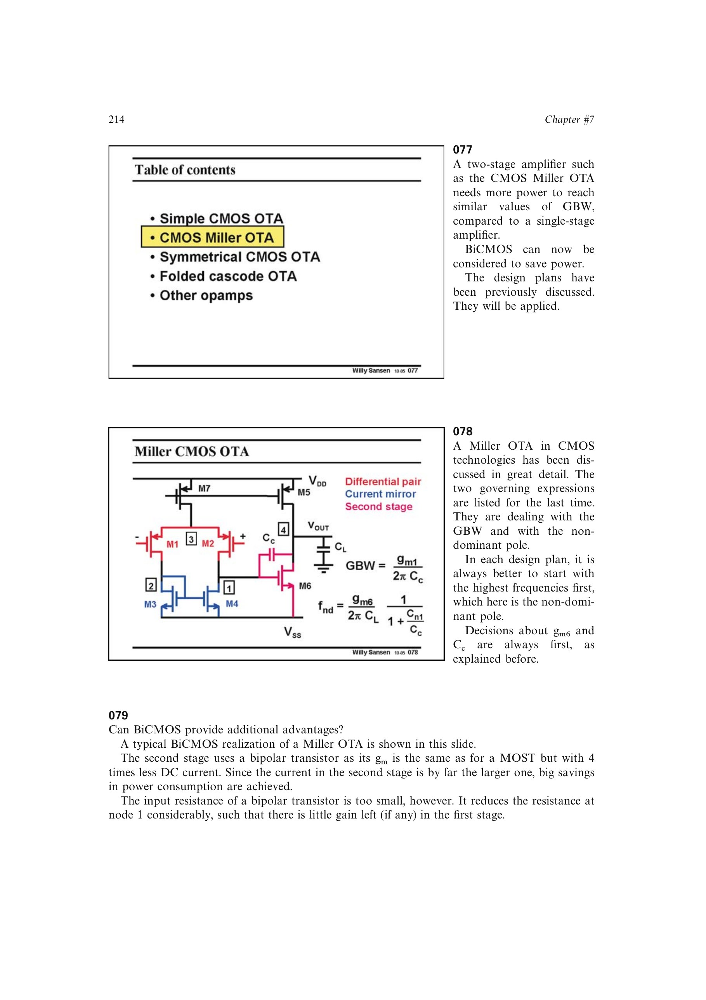

# 用双极型第二级降低 Miller OTA 功耗

CMOS Miller OTA 给出两级结构和主导功耗位置；双极型小信号模型给出较高的 (g_m/I)；射极跟随器隔离恢复第一级高阻节点；三管双极型电流镜把两侧直流电位重新配平。四者共同得到可用的 BiCMOS Miller OTA。

来源：第 7 章 pp. 214-215，077-079。边权 3.5：需要同时解决跨导效率、级间负载和直流匹配三个约束。

## 原书图示

