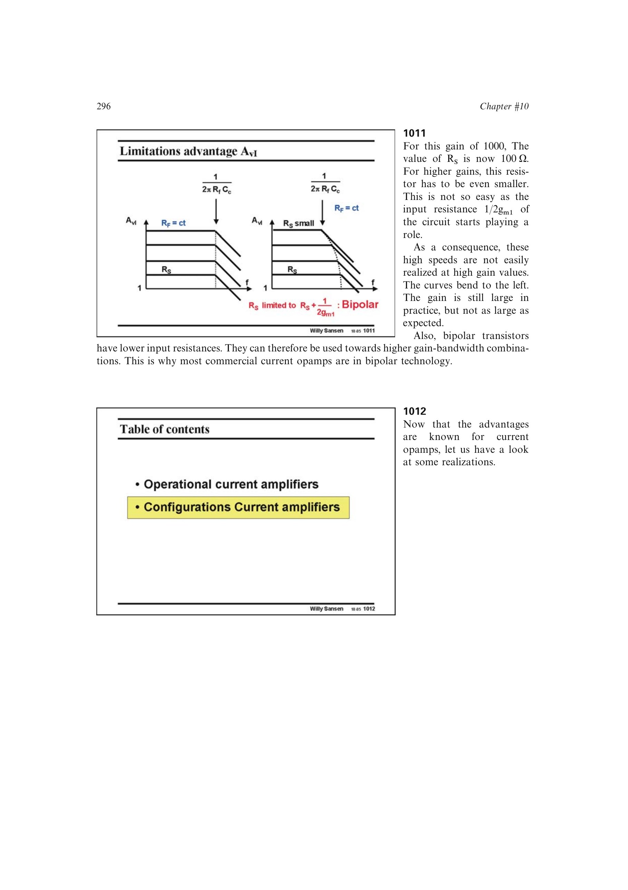

# 用高 gm/I 降低电流输入节点电阻

电流运放的高增益边界由 `R_S+1/(2g_m)` 决定。BJT 小信号模型给出 `g_m/I_C≈1/U_T`，在同电流下可取得较大 `g_m`；结合足够的 `f_T`，可把输入电阻限制推到更小 `R_S` 和更高闭环增益。

来源：第 10 章 pp. 296-300，1011-1019。边权 2.5：把器件跨导效率和截止频率直接映射到反馈电阻可选范围。

## 原书图示

