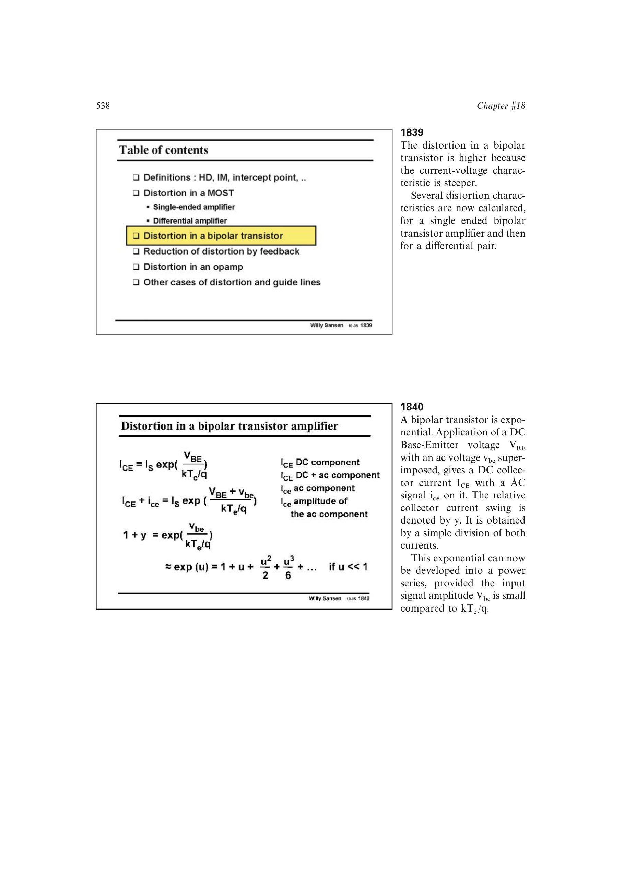

# 从指数律求 BJT 单管失真

在静态电流处把 `exp(vbe/UT)` 展开为 `1+u+u^2/2+u^3/6`，去除直流并按相对电流摆幅归一化；将 `a2/a1=1/2`、`a3/a1=1/6` 代入双音公式，得到 `IM2=U/2`、`IM3=U^2/8`。

来源：第 18 章 pp. 538-540，图 18.43、18.45。边权 3：指数展开和互调系数换算。

## 原书图示

