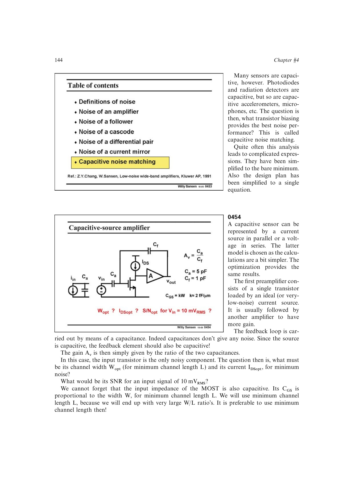

# 平衡跨导增益与输入电容负担

增大输入管宽度提高 `g_m`、降低沟道噪声，却同时增大 `C_GS`，提高从栅端噪声到传感器端的电容变换比。把两种宽度依赖代入输入噪声并求极小，得到 `C_GS=C_sensor+C_feedback`。

来源：第 4 章 pp. 144-147，0453-0458。边权 4：需联合输入折算噪声、栅电容、闭环电容比与带宽/SNR约束完成尺寸优化。

## 原书图示

