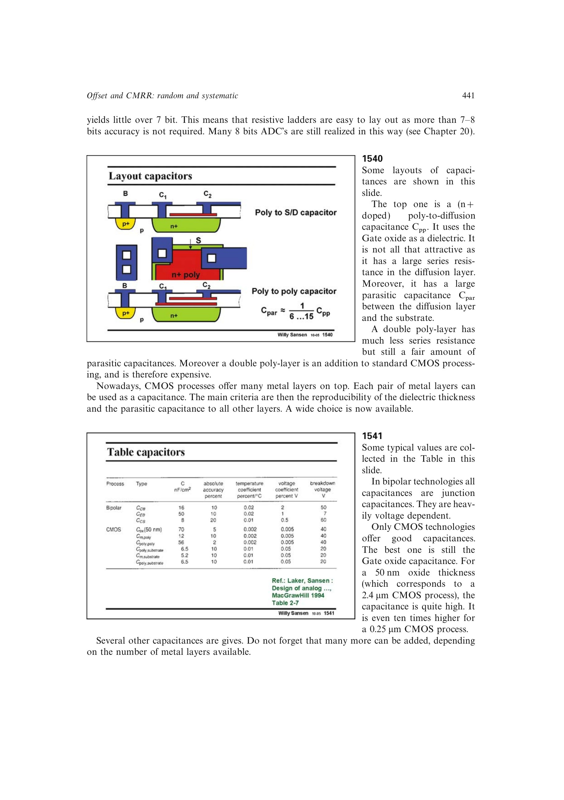

# 由局部误差和全局误差估算电容精度

电容边缘误差随尺寸平均，但介质厚度等空间梯度仍保留，故精度曲线比纯局部误差更平缓。对约 10 um 方形单元采用源书 0.1% 经验值，可换算为约 60 dB、约 10 位；共质心阵列再平均全局项。

来源：第 15 章 pp. 441-443、446-447，1540-1543、1551。边权 3：联合尺寸律、空间梯度和单位阵列解释电容精度的不同斜率及位数。

## 原书图示

