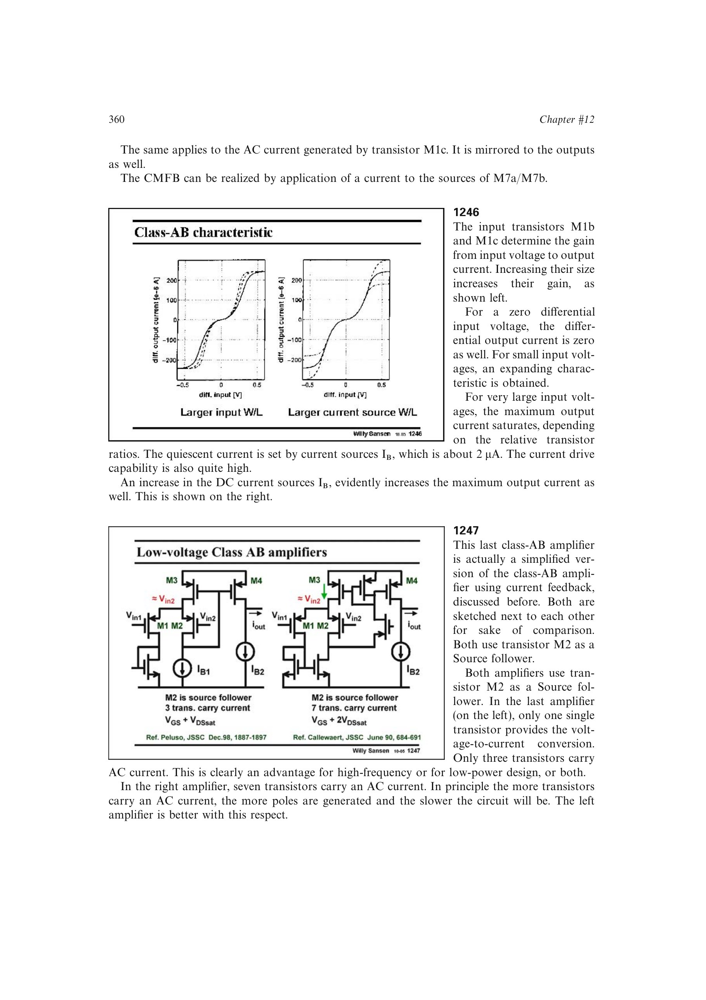

# 由信号电流路径估计附加极点

源跟随参考跨导器把 AC 限于跟随管、主跨导管和输出镜像，电流反馈 Class-AB 则让更多镜像与反馈器件承载信号。每个承载 AC 的器件都会带来寄生电容和潜在内部节点；结合单级寄生极点模型，路径器件数增加通常意味着更多极点和更高动态功耗。

来源：第 12 章 pp. 360-361，1245-1247。边权 3：需要从原理图中区分只承载 DC 的偏置器件和真正承载 AC 的信号器件。

## 原书图示

