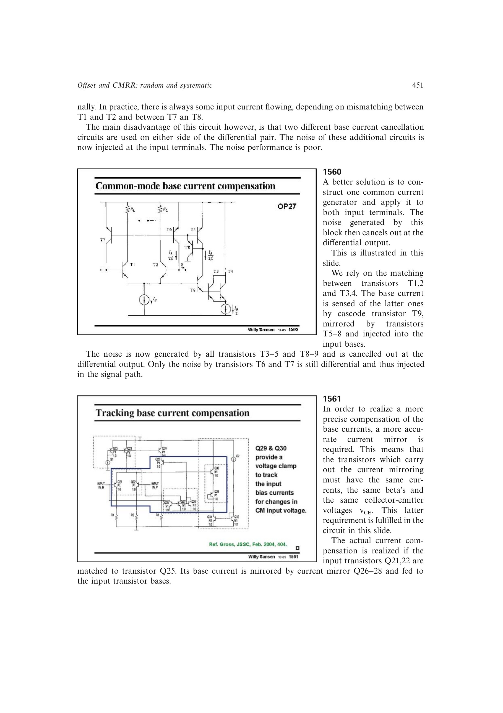

# 用共用发生器实现低噪声基流补偿

差分输入两侧若各用一套补偿器，辅助噪声会成为差模输入噪声。让一个匹配复制对感知基流并经共用镜像同时注入两端，大部分辅助噪声成为共模并在差分输出相消；自举环路还保持复制管与输入管的 `VCE` 相等。

来源：第 15 章 pp. 451-453，1560-1563。边权 4：需要同时满足基流幅值复制、共模跟随、器件电压匹配和差分噪声相消。

## 原书图示

