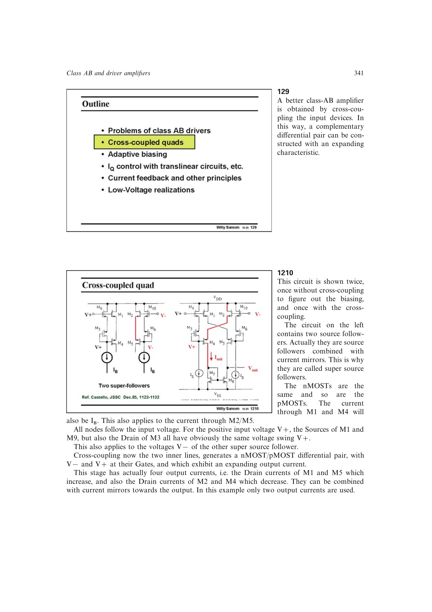

# 交叉连接跟随镜像支路生成扩张差分电流

差分对给出正负输入比较，源跟随器让内部节点随输入移动，电流镜则复制并组合四支电流。把两套互补跟随镜像支路交叉后，每个输入同时控制一只 nMOST 和一只 pMOST，平方律扩张型目标转化为四路同相可用的差分输出电流。

来源：第 12 章 pp. 341-344，129-1215。边权 4：需要同时追踪交叉极性、四条电流路径、DC 偏置和输出组合；这些子机制已由尾点承载，剩余连接是不可再拆的核心构造。

## 原书图示

