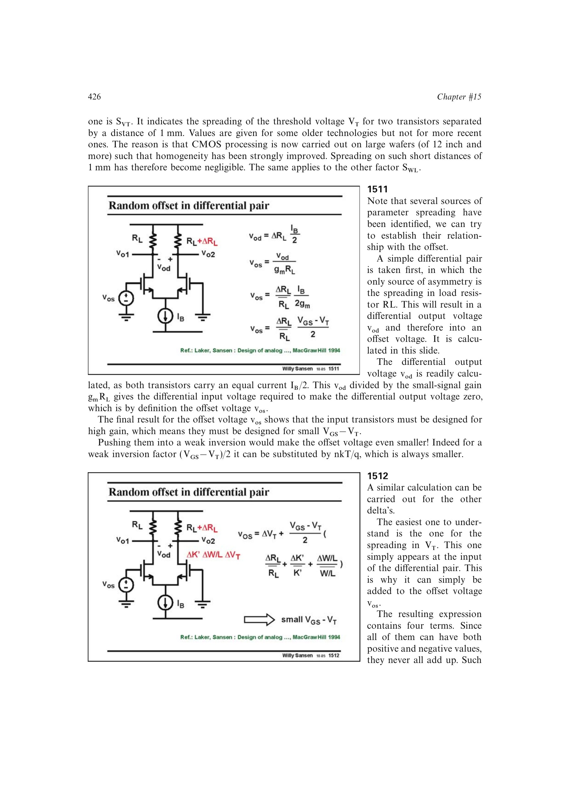

# 折算差分对参数失配到输入端

负载差异先产生 `vod=Delta RL*IB/2`，除以差模增益 `gm*RL` 得到输入等效失调；`Delta VT` 直接位于输入，其余 `K'`、尺寸和负载项都经 `1/gm` 折算。代入 `gm=2ID/VOV` 后得到 `VOV/2` 的共同缩放因子。

来源：第 15 章 pp. 426-427，1511-1512。边权 3.5：联合差分平衡、多个参数扰动和输入折算完成一阶失调式。

## 原书图示

