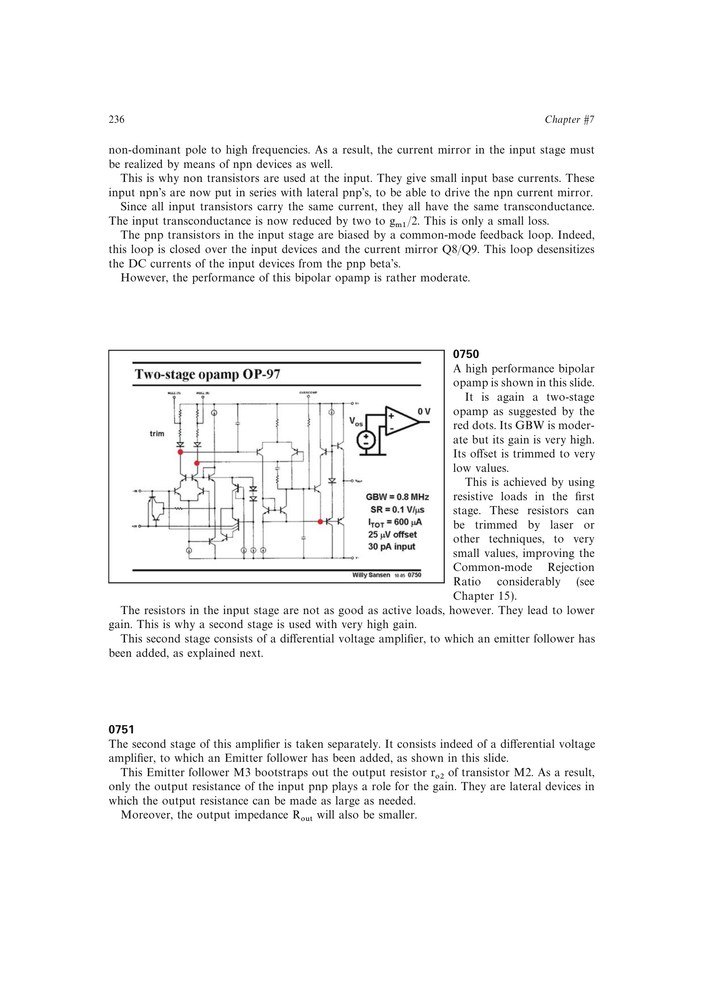

# 用射极跟随器自举前级输出电阻

射极跟随器隔离提供近单位电压跟随，普通自举原理说明被同步驱动的电阻等效增大，双极型小信号模型给出电流增益 (eta)。联立后可得增益约乘 (eta_3)、输出阻抗约除以 (eta_3)，而 GBW 保持近似不变。

来源：第 7 章 pp. 236-237，0750-0751。边权 3.5：必须做小信号反馈分析才能看出同一跟随器同时提高增益并降低输出阻抗。

## 原书图示

