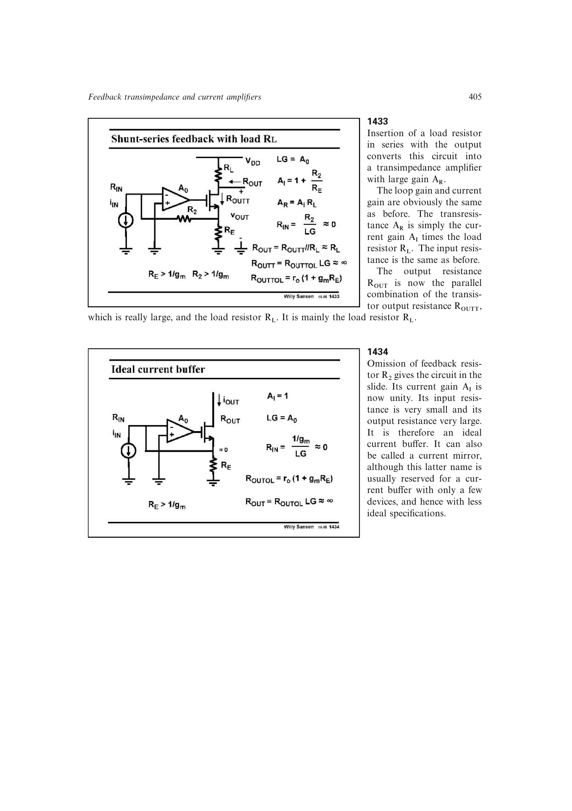

# 从并串联电流放大器识别运放辅助电流镜

令并串联电流放大器的电流增益为一，并以匹配或比例 MOS 管复制电流，就得到运放辅助电流镜。全局反馈压低输入阻抗，镜像器件比例设定输出电流，并可把输入漏端维持在低电压以改善低压顺从性。

来源：第 14 章 pp. 405-406，1434-1435。边权 2.5：由一般并串联闭环和基本电流镜直接化简，是既有概念的一条新并行推导。

## 原书图示

