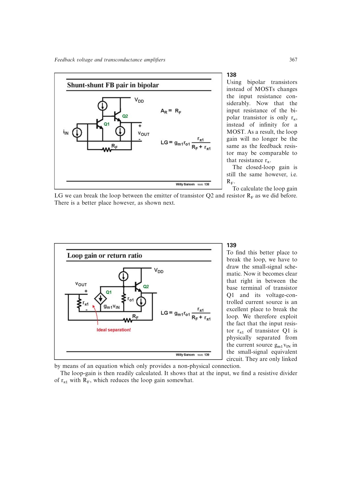

# 由有限 r_pi 推出双极反馈输入加载

BJT 小信号输入电阻与反馈网络形成分压，使回归比低于 MOS 栅输入情形；串联反馈只把这个有限开环阻抗乘以 `1+T`。加入信号源内阻后还会出现输入分压，并与输入电容构成额外极点。

来源：第 13 章 pp. 367-368、378-379，138-139、1330-1331。边权 3：必须联合 BJT 小信号模型、串并联结构和端口缩放规律。

## 原书图示

