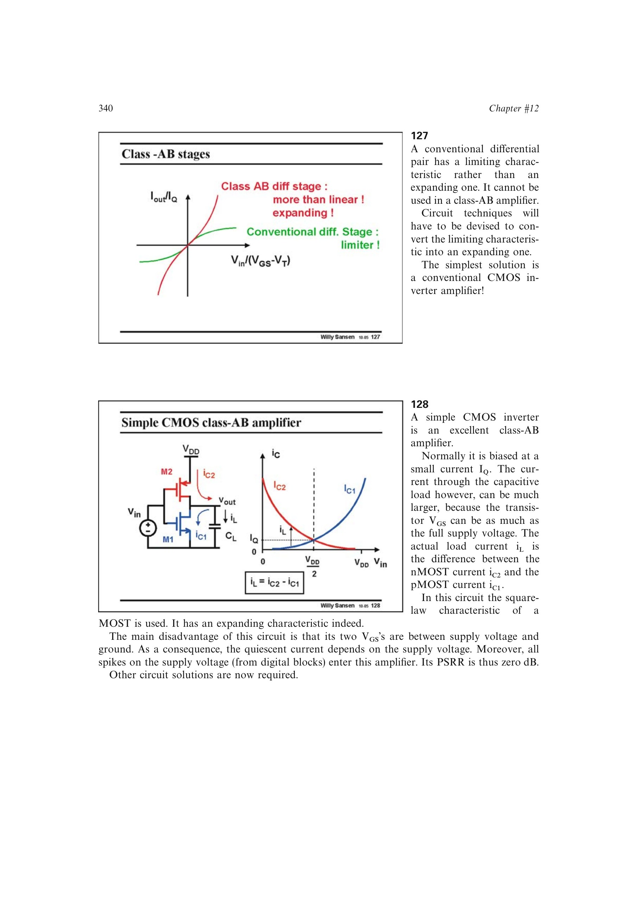

# 从跨电源栅源偏置推得零 PSRR

CMOS 反相器的扩张电流来自上下管同时受输入驱动；但其偏置没有独立参考，两个 `VGS` 直接分割电源电压。电源变化于是同时改变静态工作点和瞬时漏电流，信号通道无法区分输入变化与电源扰动，形成近似 0 dB 的电源抑制。

来源：第 12 章 pp. 340-341，127-128。边权 2.5：是由反相器偏置拓扑对扩张型优势作直接边界分析。

## 原书图示

