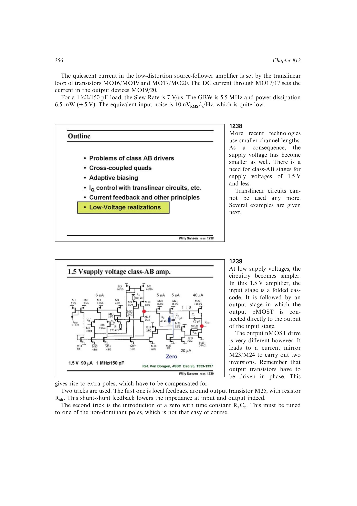

# 用局部降阻和调零抵消低压驱动附加极点

Class-AB 上下管要求同相驱动，低压结构为获得正确极性而加入镜像和反相节点；两级稳定性关系要求这些非主极点高于环路交越。局部反馈可降低输出管驱动节点阻抗，调零电阻又能把补偿零点移到剩余非主极点附近，两者联合恢复相位裕度。

来源：第 12 章 pp. 356-357，1238-1239。边权 4：必须先识别附加节点，再分别以阻抗压低和零点调谐处理；子技术已由尾点承载，联合配置是关键稳定性桥梁。

## 原书图示

