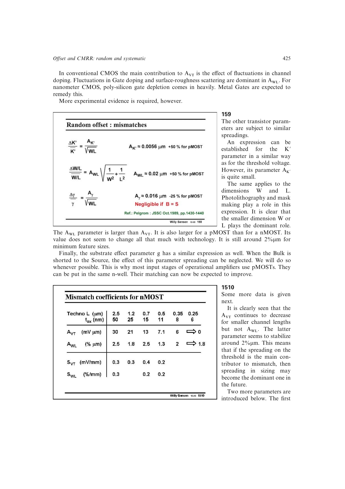

# 扩展阈值面积律到 MOST 参数组

MOST 的两个几何自由度决定面积和比例，故同一统计思路可用于 `K'`、`W/L` 和体效应参数。阈值、工艺因子按 `1/sqrt(WL)` 缩放，而几何比误差由 `sqrt(1/W^2+1/L^2)` 暴露较小尺寸的主导作用。

来源：第 15 章 pp. 425-426，159-1510。边权 3：需要区分面积型随机项、边界型几何项及体端连接带来的消项。

## 原书图示

