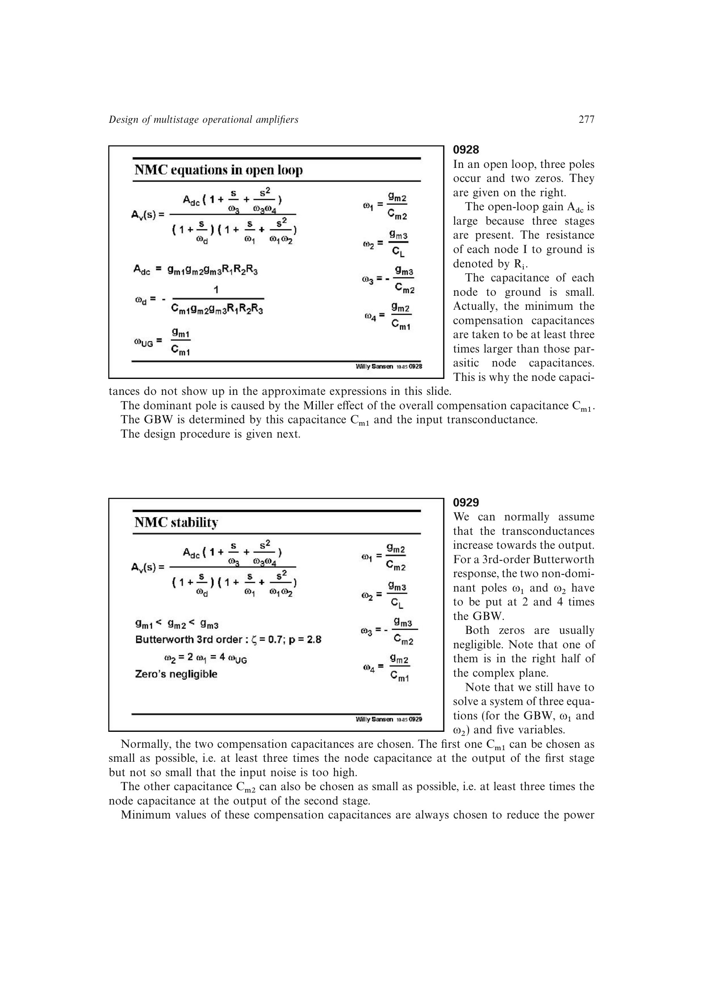

# 把噪声所需电容传递到三级功耗

积分噪声先给出 `Cm1` 的下限；在固定 GBW 下，输入跨导必须随 `Cm1` 增大。三级极点配置再把该 GBW 和补偿电容传递到 `g_m2`、`g_m3`，因此降噪要求会沿整个尺寸链抬高电流。

来源：第 9 章 pp. 277-278，0928-0929；第 6 章 pp. 206-208，0648-0651。边权 3：需联合积分噪声律与三级跨导尺寸式完成跨规格推导。

## 原书图示

