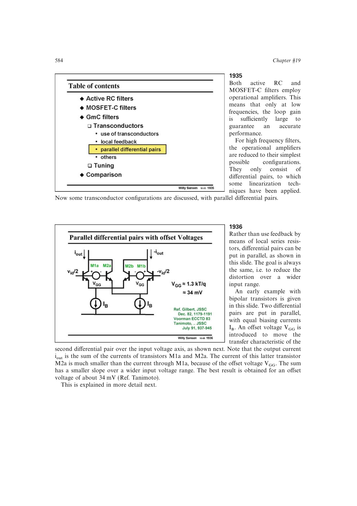

# 用平移并联差分对抵消跨导曲率

把两个差分对的传输曲线沿输入轴反向平移并相加，中心跨导下降但平坦区展宽；BJT 可用约 34 mV 偏移或约 4 倍面积比实现，MOST 则联合尺寸比和偏置电流比选择。多对扩展能进一步展宽，但继续牺牲跨导。

来源：第 19 章 pp. 584-588，图 19.36-19.43。边权 4：需从差分大信号曲线、偏移实现和多支路加权共同建立抵消，是既有结论的独立平行路线。

## 原书图示

