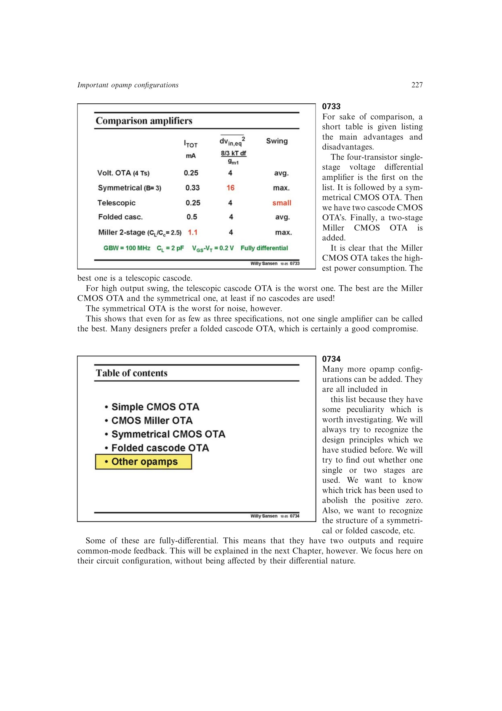

# 用关键规格比较 OTA 拓扑

伸缩式级联、对称 OTA、折叠级联和 CMOS Miller OTA 分别给出候选结构；级数功耗代价解释多级结构为何更耗电；输出摆幅和折叠级联噪声预算补齐摆幅、噪声轴。把这些结果并列后可证明不存在全规格最优拓扑。

来源：第 7 章 p. 227，0733-0734。边权 4：这是跨多种结构和三项关键规格的主要设计判断；各基础性能已拆成独立前提，未隐藏中间结论。

## 原书图示

