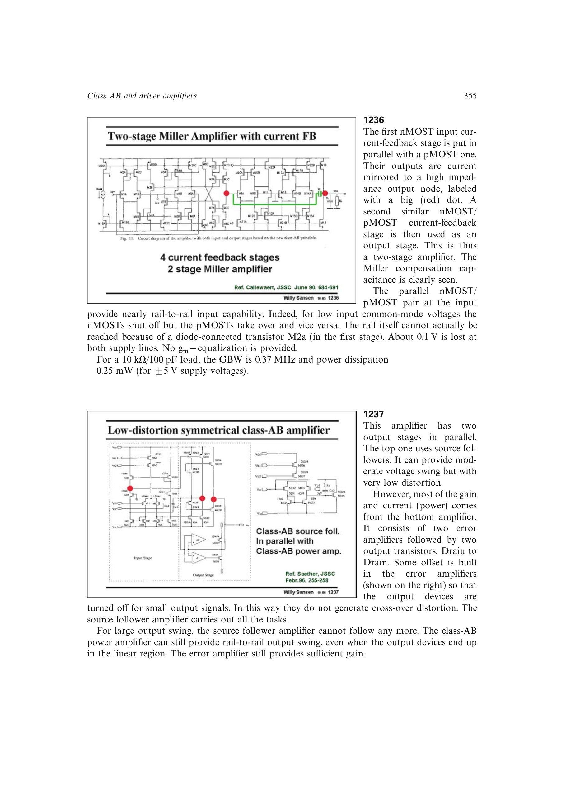

# 让跟随器覆盖交越区、功率级覆盖大摆幅

源跟随器具有低失真和低输出阻抗但余量不足；局部误差放大的漏端相接功率级可在器件进入线性区后继续靠近电源轨；交越失真主要发生在两半周的小信号交接。给功率路径设置失调使其在小信号关闭，便由跟随器独占交越区，而大信号时功率路径再接管。

来源：第 12 章 pp. 355-356，1237。边权 3.5：需设计两条非等价路径的幅度分工和连续接管，而不是简单并联增益级。

## 原书图示

